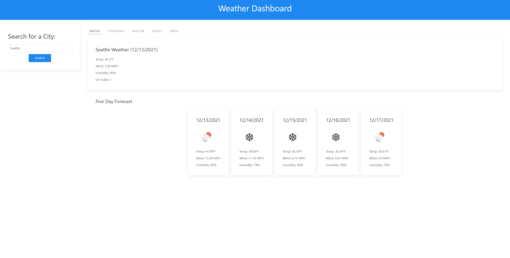

## Weather Dashboard

The purpose of this web application is to display basic weather information for
a city (or several cities) given by a user. Weather information is pulled from
[the OpenWeather API](https://openweathermap.org/api/), and the page is styled
using [the UIkit framework](https://getuikit.com/). The deployed webpage can be
accessed [here](https://cameronmseibel.github.io/weather-dashboard/), and a
screenshot of the page will be found below.

